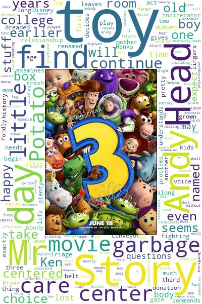

# Tiny-step-on-data-wrangling
This is a small project on data wrangling where I applied the concepts of data wrangling from gathering data from different sources to assessing it and then cleaning it. Besides, I used the gathered dataset to create a fansy word cloud on movies posters.

   .png)
